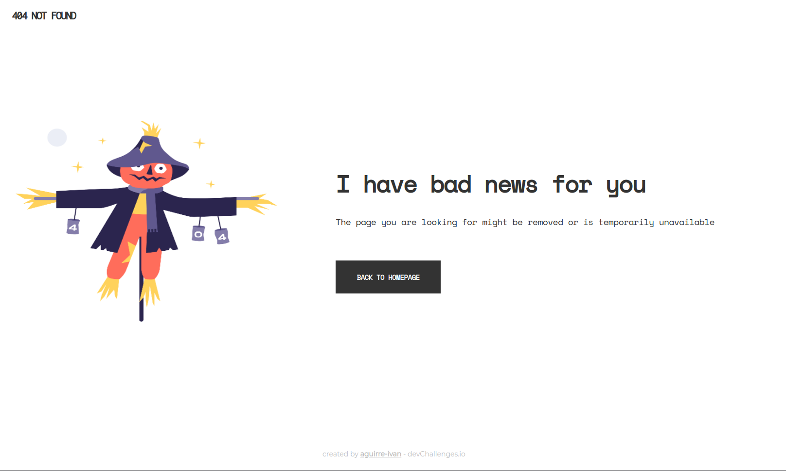
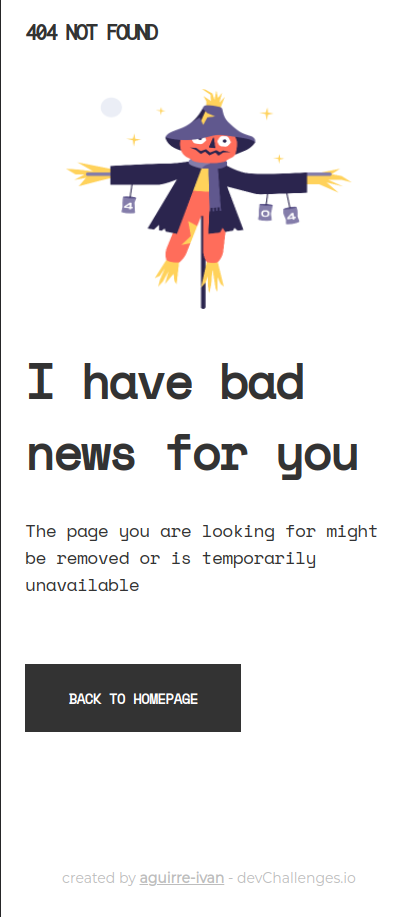

<!-- Please update value in the {}  -->

<h1 align="center">404 Not Found</h1>

   Solution for a challenge from  <a href="http://devchallenges.io" target="_blank">Devchallenges.io</a>.

  <h3>
    <a href="https://aguirre-ivan.github.io/responsive-web-developer/old-challenges/404-not-found/">
      Demo
    </a>
  </h3>

This application/site was created as a submission to a [DevChallenges](https://devchallenges.io/challenges) challenge. The challenge was to build an application to complete the given user stories.

## Overview

